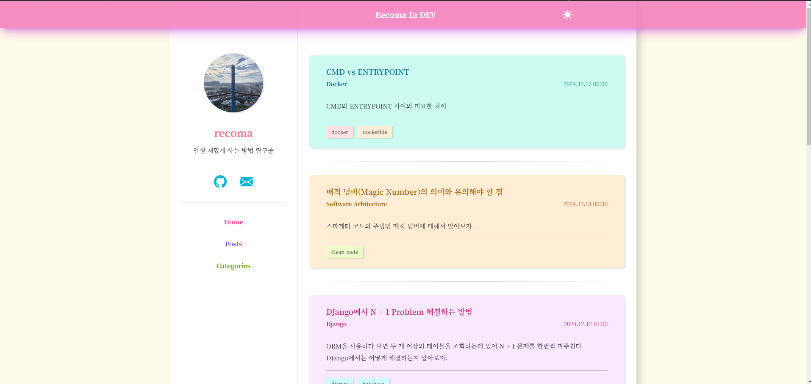

# LolliNeon


**Lollineon** is jekyll engined blog that is LolliPop styled in light-mode and NeonSign styled in dark-mode


## 👓 Preview



<br >


## 💿 Installation

### Fork This

* Just [fork this repo](https://github.com/recoma96/lollineon/fork).
* If you use this by deploying github page. Use **`release` branch**. Because `release` is published branch.

### Set Github Token

1. For deploy this. Save "Github Token" as secret key.
2. Goto Repository -> Settings -> Secrets and variables -> Actions -> New Repository secret
3. Write Name as `ACCOUNT_GITHUB_TOKEN` and Secret as your github token. then click "Add secret".

### Download to local

0. Download this repo.
1. Install `ruby`
2. Run `bundle install` for install packages.
3. install tailwindcss compiler
    ```
    $ cd tailwind
    $ npm i
    $ cd ..
    ```
4. Run `tailwind-compiler-dev.sh` and don't terminate while develop this. Because this theme use [tailwindcss](https://tailwindcss.com/). while running it. CSS is compiled automticlly when you modify html files.
5. Run `jekyll serve` for run this. and write your story or custom styles.


### Change Deployment branch

After building by using github action. The new branch named as 'gh-pages' is added to your github repository. `gh-pages` is result of build. For deploy this. you change deploy branch as `gh-pages`

1. Goto Github Repo -> Settings -> Pages
2. change branch to `gh-pages`
3. re push or re-run github action.


## ✔️ Usage

### Setting Configuration

Add following to the `_config.yml`

```yaml
title: <Your blog name>
email: <Your email>

nickname: <Your nickname>
user_description: <Write short description about you>
profile_image: <url of your profile image> # width and height of your image must be same!

social:
  github:
  email:
  x: <Your twitter page>
  instagram:
  youtube:
  website: <Your other website>
```


### Home (About) Page

Modify `index.md` file and add the following

```
---
layout: home
title: Home
permalink: /
---

# This is My Blog

This name is LolliLemon!

```


### Posting

Create markdown file into `_posts` file. This filename following this

```
YYYY-mm-dd-{this is post title}.md
```
* `YYYY-mm-dd` is Date (ex: 2024-09-13)
* `post-title` is only english and hipen `-`


Post header following this

```
---
layout: post
title:  <Post title name>
date:   YYYY-mm-dd HH:MM:SS (+0000)
categories: <Category-name of this post>
summary: <short summary of this post>
tags: ["tag1", "tag2"]
---
```


### Upload And Import Image Into markdown files

Sometimes, You need to import some images into post and index page. To import this following this

1. add image you want into `assets/img/post`
2. write this into markdown file
  ```
  
  ```

## Roll of Pull Request

* PR to `main` branch. no others.
* **DO NOT** add `assets/main.css` compiled from taimwindcss. All of branches except release don't have `main.css`. this file is for only deploy.