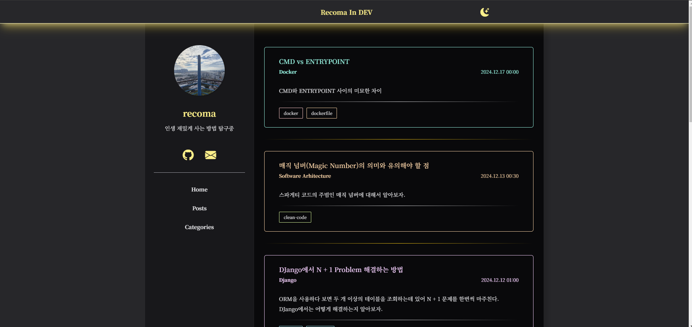

# LolliNeon


<br > <br >




**Lollineon** is jekyll engined blog that is LolliPop styled in light-mode and NeonSign styled in dark-mode

## 💿 How To install

### Install Packages

Just [fork this repo](https://github.com/recoma96/lollineon/fork).


## ✔️ Usage

### Setting Configuration

Add following to the `_config.yml`

```yaml
title: <Your blog name>
email: <Your email>

nickname: <Your nickname>
user_description: <Write short description about you>
profile_image: <url of your profile image> # width and height of your image must be same!

social:
  github:
  email:
  x: <Your twitter page>
  instagram:
  youtube:
  website: <Your other website>
```


### About Page

Modify `about.md` file and add the following

```
---
layout: about
title: About
permalink: /about/
---

# This is My Blog

This name is LolliLemon!

```


### Posting

Create markdown file into `_posts` file. This filename following this

```
YYYY-mm-dd-{this is post title}.md
```
* `YYYY-mm-dd` is Date (ex: 2024-09-13)
* `post-title` is only english and hipen `-`


Post header following this

```
---
layout: post
title:  <Post title name>
date:   YYYY-mm-dd HH:MM:SS (+0000)
categories: <Category-name of this post>
summary: <short summary of this post>
tags: ["tag1", "tag2"]
---
```


### Upload And Import Image Into markdown files

Sometimes, You need to import some images into post and about page. To import this following this

1. add image you want into `assets/img/post`
2. write this into markdown file
  ```
  
  ```


## 🔧 Development

0. Download this repo.
1. Install `ruby`
2. Run `bundle install` for install packages.
3. Run `tailwind-compiler-dev.sh` and don't terminate while develop this. Because this theme use [tailwindcss](https://tailwindcss.com/). while running it. CSS is compiled automticlly when you modify html files.
3. Run `jekyll serve` for run this.
